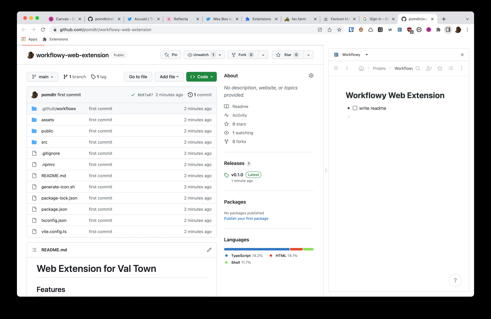

# Web Extension for Val Town

> **Warning** This extension only support Chrome 114+. It will not work on other browsers.

## Features

### Side Panel

Click on the extension icon to open val town in your browser side panel

## Installation

1. Download `extension.zip` from the [releases page](https://github.com/deta/web-extension/releases/latest).
2. Extract the zip file.
3. Go to your browser's extensions page (<chrome://extensions>).o
4. Enable developer mode.
5. Click on "Load unpacked" and select the extracted `extension/` folder.
